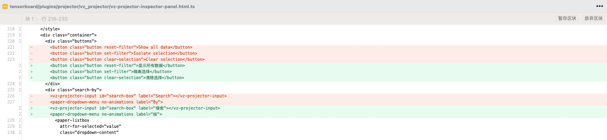

# chinesize
一个汉化 HTML、Angular 项目的工具

## 安装

```sh
$ npm install chinesize -g
```

## 使用

```sh
$ chinesize --help
Usage: chinesize [options] [command]

CLI to convert English Angular project to Chinese

Options:
  -V, --version            output the version number
  -h, --help               display help for command

Commands:
  extract [options] <dir>  Extract English texts of Angular project
  replace [options] <dir>  Replace English texts of Angular project to Chinese
  help [command]           display help for command
```

chinesize 提供了两个子命令：

- `extract`：提取代码里的英文文本
- `replace`：将代码里的英文文本替换成中文文本

### 提取

使用 `chinesize extract` 提取英文文本

```sh
$ chinesize help extract
Usage: chinesize extract <dir> [options]

Extract English texts of Angular project

Arguments:
  dir                      directory of Angular project

Options:
  -t, --type <type>        file type (choices: "html", "js")
  -o, --output <filePath>  path of file for writing the extracted English text
  -h, --help               display help for command
```

`extract` 有 1 个参数和 2 个选项：

- `dir`：汉化的 Angular 项目目录
- ` --type <type>`：要转换的文件类型，是 `html` 文件还是 `js/ts` 文件。如果没有提供，则同时转换两者
- `--output <filePath>`：输出文件路径，提取的英文文本将写入这个文件。如果没有提供，默认是 Angular 项目目录下的 `chinesize/texts-to-translate-{html|ts}.json'` 文件

比如要转换 [`tensorboard`](https://github.com/tensorflow/tensorboard) 项目

```sh
$ chinesize extract ~/Documents/tensorboard
```

将 `tensorboard` 里的英文文本提取到 `~/Documents/tensorboard/chinesize/texts-to-translate.json`

下面是这个文件的节选

```json
{
  "Remove": "Remove",
  "Sort Descending": "Sort Descending",
  "Sort Ascending": "Sort Ascending",
  "Filter": "Filter",
  "Insert Column Left": "Insert Column Left",
  "Insert Column Right": "Insert Column Right",
  "Add Column": "Add Column",
  "No Matching Values": "No Matching Values",
  "Include Undefined": "Include Undefined",
  "General": "General",
}
```

### 翻译

然后您需要将这个 json 文件翻译成中文，您可以使用翻译软件、翻译 API（[Google Translate API](https://cloud.google.com/translate)）、AI 工具或者交给您们的翻译团队翻译。下面是我用 [Codeium](https://codeium.com/) 工具生成的

```json
{
  "Remove": "删除",
  "Sort Descending": "降序排序",
  "Sort Ascending": "升序排序",
  "Filter": "筛选",
  "Insert Column Left": "插入左侧列",
  "Insert Column Right": "插入右侧列",
  "Add Column": "添加列",
  "No Matching Values": "没有匹配的值",
  "Include Undefined": "包括未定义的值",
  "General": "一般"
}
```

### 替换

翻译好了之后，使用 `chinesize replace` 替换英文文本为中文文本

```sh
$ chinesize help replace
Usage: chinesize replace <dir> [options]

Replace English texts of Angular project to Chinese

Arguments:
  dir                                     directory of Angular project

Options:
  -t, --type <type>                       file type (choices: "html", "js")
  -i, --input <filePath>                  path of file for reading the Chinese text
  -p, --prettier-config <configFilePath>  path of config file for prettier
  -h, --help                              display help for command
```

`replace` 有 1 个参数和 3 个选项：

- `dir`：汉化的 Angular 项目目录
- ` --type <type>`：要转换的文件类型，是 `html` 文件还是 `js/ts` 文件。如果没有提供，则同时转换两者
- `--input <filePath>`：中英文翻译的文件路径。如果没有提供，默认是 `extract` 生成的文件路径
- `--prettier-config <configFilePath>`：`prettier` 配置文件路径。如果没有提供，则不使用 `prettier` 格式化代码

比如要转换 [`tensorboard`](https://github.com/tensorflow/tensorboard) 项目

```sh
$ chinesize replace ~/Documents/tensorboard -i ~/Documents/tensorboard/translated-texts.json -p ~/Documents/tensorboard/.prettierrc.json
```

实现效果（节选）



## 不足之处

该工具只能转换 HTML 静态文本、`title/label` 属性中的纯文本，不能转换变量值和插值，因为变量值可能不只是用于展示还用于代码逻辑，比如

```js
let type = ""

// type 的代码逻辑
if (type === "") {
  // ...
}

class MyElement {
  static readonly template = html`
    <span>{{ type }}</span>
  `;
}
```

## Blog

[创建 Node.js 命令行工具](https://www.joylearn123.com/2024/08/23/node-cli/)
